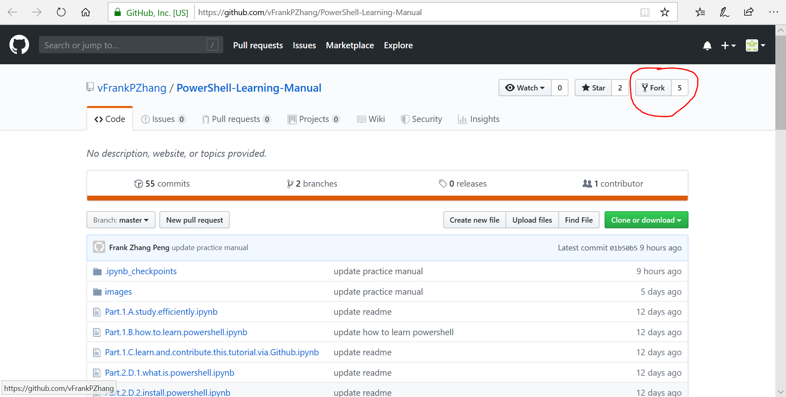
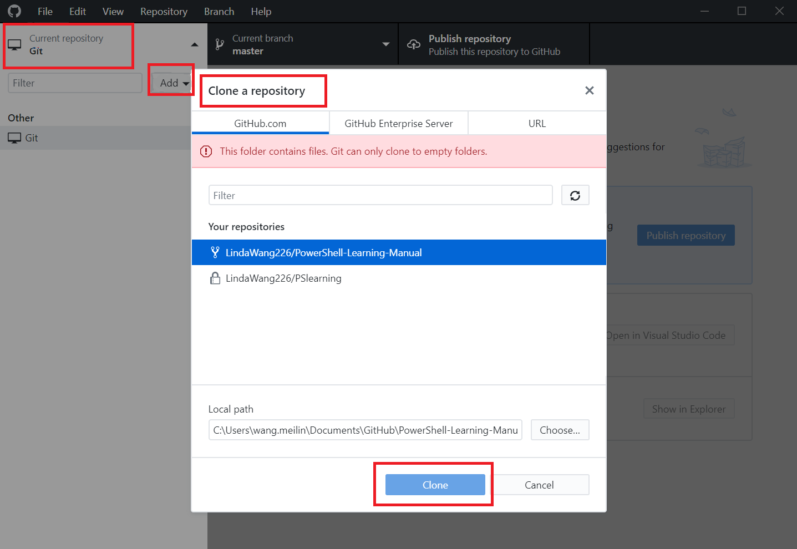
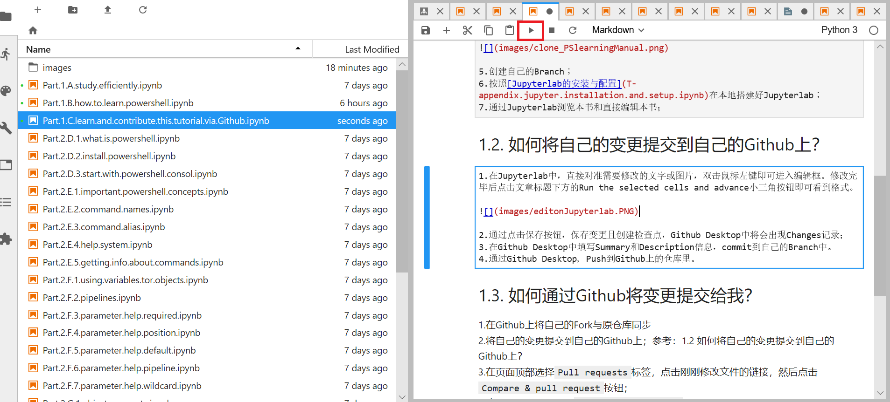
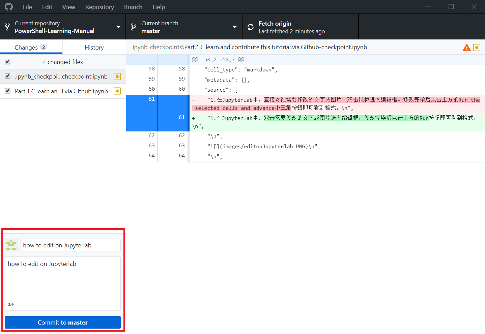
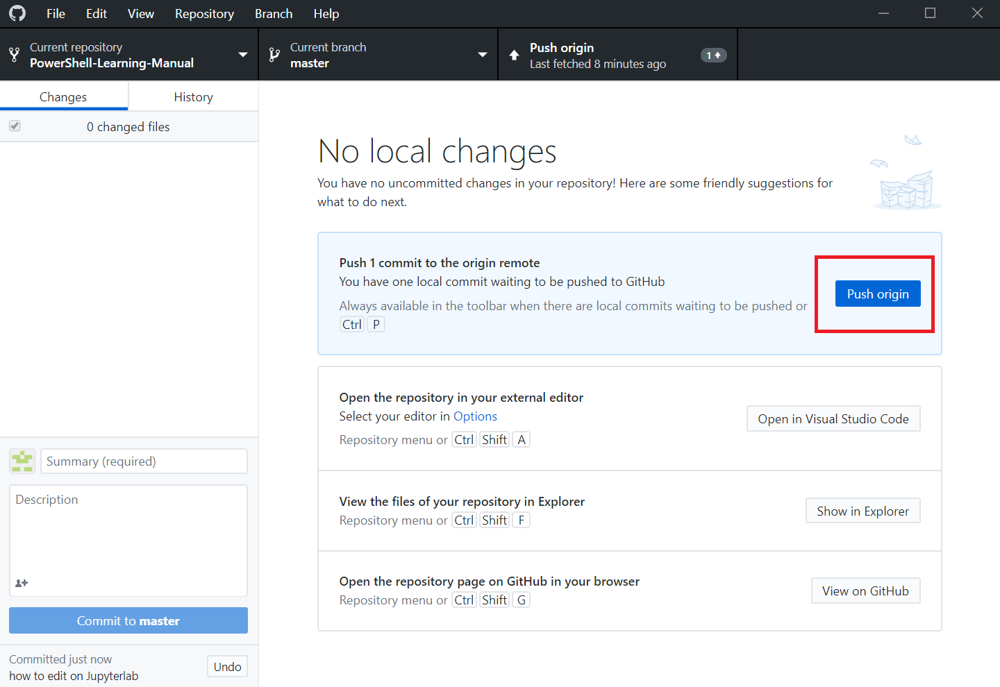

# 如何通过Github学习及参与本教程编写？

Git是一个分布式版本控制软件，可以通过Git来共同协作，控制版本。
Github是一个基于Git的项目托管平台，很多开源及私有软件项目托管在上面。

Juypterlab是一个交互式笔记本，支持运行40多种编程语言，便于创建和共享程序文档，支持实时代码，数学方程，可视化和markdown等。

我们通过Github这个平台进行内容的协作和版本控制，通过Juypterlab进行内容的查看和编辑。

## 如何使用Jupyterlab查看和编辑本教程内容？

1.注册[github.com](https://github.com)帐号；  
2.使用浏览器访问[https://github.com/vFrankPZhang/PowerShell-Learning-Manual](https://github.com/vFrankPZhang/PowerShell-Learning-Manual)；  
3.将该仓库Fork到你自己的账户中；

4.使用[Desktop for Github](https://desktop.github.com)将[PowerShell Learning Manual]这个你Fork到你自己帐户的仓库克隆到本地；  

5.创建自己的Branch；  
6.按照[Jupyterlab的安装与配置](T-appendix.jupyter.installation.and.setup.ipynb)在本地搭建好Jupyterlab；  
7.通过Jupyterlab浏览本书和直接编辑本书；  

## 如何将自己的变更提交到自己的Github上？

1.在Jupyterlab中，双击需要修改的文字或图片进入编辑框。修改完毕后点击上方的Run按钮即可看到格式。

2.通过点击保存按钮，保存变更且创建检查点，Github Desktop中将会出现Changes记录；  
3.在Github Desktop中填写Summary和Description信息，commit到自己的Branch中。 

4.通过Github Desktop，Push到Github上的仓库里。

## 如何通过Github将变更提交给我？

1.在Github上将自己的Fork与原仓库同步  
2.将自己的变更提交到自己的Github上；参考：1.2 如何将自己的变更提交到自己的Github上？  
3.在页面顶部选择`Pull requests`标签，点击刚刚修改文件的链接，然后点击`Compare & pull request`按钮；  
4.确认无误之后，点击`Create pull request`按钮;  
5.我，PowerShell Learning Manual这个仓库的所有者，会被通知有人提交了Pull request；  
6.我确认这个Pull request后，按`Merge pull request`按钮，你提交的修正就会被合并到我的内容里，便参与了一次编辑本教程内容。

**提交Pull request的最佳实践：**

> * 提交Pull request之前，必须先将你的Fork与原仓库同步到最新；  
> * 尽量每次只提交一个小修改；  
> * 提交时尽量简短、清楚说明修改原因；  
> * 耐心等待回复。
