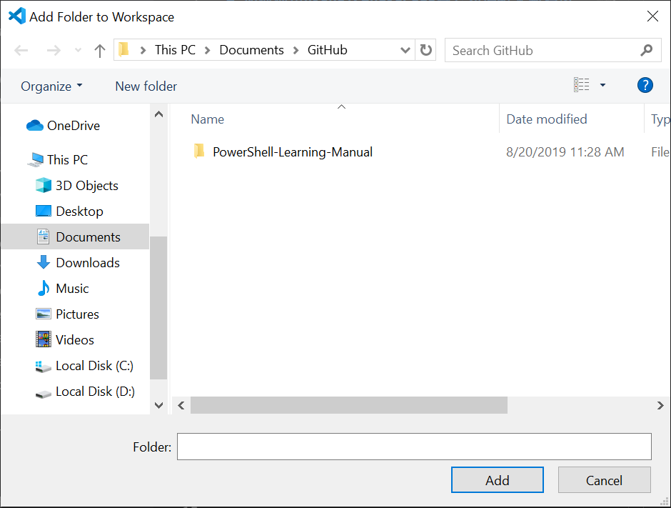
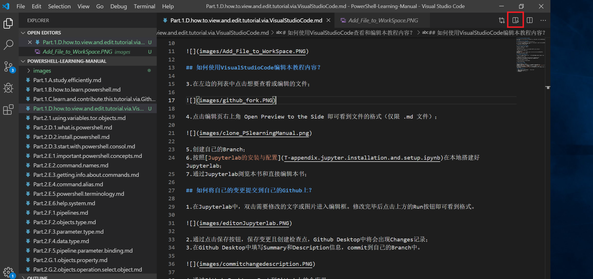

# 如何使用VisualStudioCode查看和编辑本教程内容？

Visual Studio Code 是一个运行于 Mac OS X、Windows和 Linux 之上的，针对于编写现代 Web 和云应用的跨平台源代码编辑器。

## 如何使用VisualStudioCode查看本教程内容？
1.下载并安装[Visual Studio Code](https://code.visualstudio.com/)

2.打开Visual Studio Code，点击左上角 `File` -> `Add Folder to Workspace`。进入本地Git Hub Desktop所对应的本地路径，选择文件夹，点击`Add`，即可显示文件列表。

## 如何使用VisualStudioCode编辑本教程内容？

3.在左边的列表中点击想要查看或编辑的文件；点击编辑页右上角`Open Preview to the Side`即可看到文件的格式（.md文件）；

 

## 如何将自己的变更提交到自己的Github上？这块还没弄清楚，写不下去了

1.在左列`Suorce Control`中，创建一个新的Branch。修改完毕后点击上方的Run按钮即可看到格式。

2.通过点击保存按钮，保存变更且创建检查点，Github Desktop中将会出现Changes记录；  
3.在Github Desktop中填写Summary和Description信息，commit到自己的Branch中。 

4.通过Github Desktop，Push到Github上的仓库里。

## 如何通过Github将变更提交给我？

1.在Github上将自己的Fork与原仓库同步  
2.将自己的变更提交到自己的Github上；参考：1.2 如何将自己的变更提交到自己的Github上？  
3.在页面顶部选择`Pull requests`标签，点击刚刚修改文件的链接，然后点击`Compare & pull request`按钮；  
4.确认无误之后，点击`Create pull request`按钮;  
5.我，PowerShell Learning Manual这个仓库的所有者，会被通知有人提交了Pull request；  
6.我确认这个Pull request后，按`Merge pull request`按钮，你提交的修正就会被合并到我的内容里，便参与了一次编辑本教程内容。

**提交Pull request的最佳实践：**

> * 提交Pull request之前，必须先将你的Fork与原仓库同步到最新；  
> * 尽量每次只提交一个小修改；  
> * 提交时尽量简短、清楚说明修改原因；  
> * 耐心等待回复。
