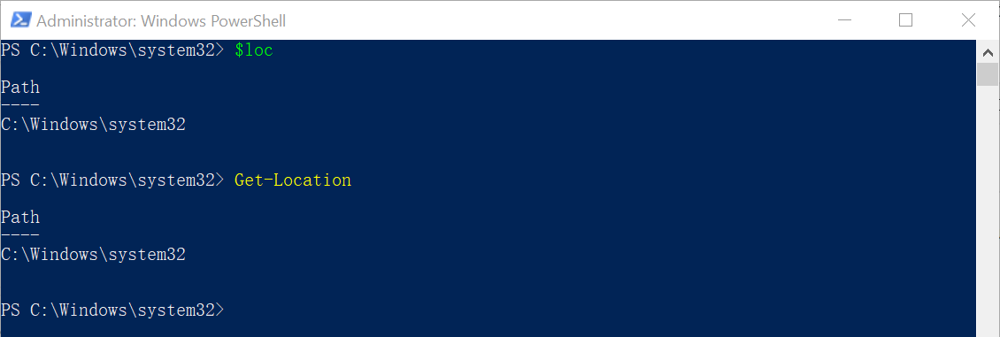
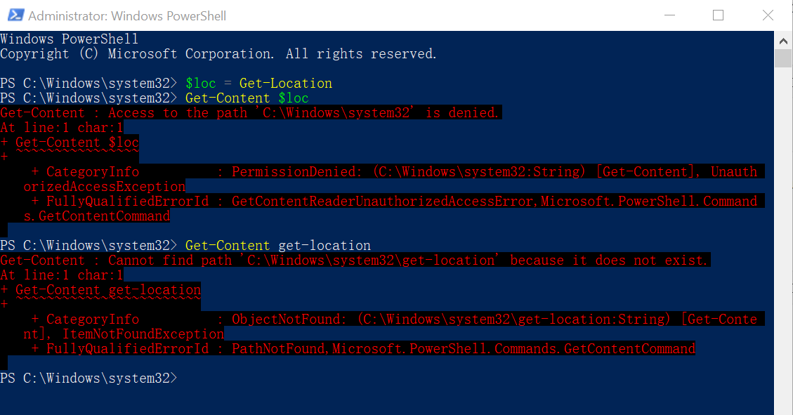
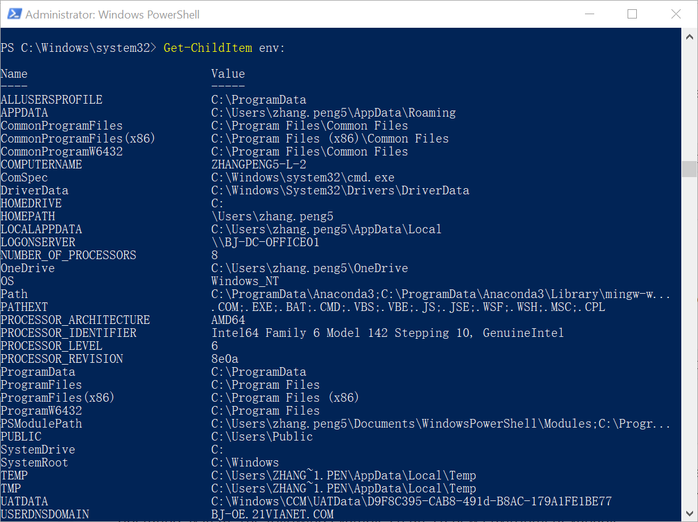
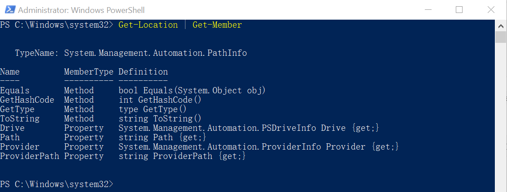

# 使用变量保存对象

前面介绍PowerShell重要概念的时候说过，PowerShell是基于对象的。

PowerShell允许你创建一个自定义的变量来保存变量。这个变两个呃名字可以包含下划线“_”和字母。

PowerShell中的变量是以“$”符号开头，然后跟一个变量名。

## 创建一个变量

变量就像是一个箱子，用来装东西。

**【例子】**

我们可以创建一个空箱子：

```bash
PS> $loc
PS>
```

我们输入符号“$”后面直接跟了一个变量名：loc，但是没有再加任何东西，这就创建了一个空变量。

我们可以把一个cmdlet的结果装进箱子里：
```bash
$loc = Get-Location
```

注意，这是是把结果装进箱子里，虽然我们直接执行

```bash
$loc
```

和

```bash
Get-Location
```



屏幕上看到的结果是一样的，但他们不是同一个东西。



## 查看变量驱动器中的变量

PowerShell内置了一个变量驱动器，用来存放提前定义好的一些变量。

**【例子】**

```bash
Get-ChildItem variable:
```


## 查看环境变量

环境变量是一系列重要的变量，PowerShell也可以直接使用Windows系统中的环境变量。

**【例子】**

```bash
Get-ChildItem env:
```



## 查看对象的信息

PowerShell基于对象，可以通过Get-Member来查看对象的信息。

**【例子】**

```bash
Get-Location | Get-Member
```



我们可以看到这个对象的信息：  
首先，对象的类型是：System.Management.Automation.PathInfo，因为Get-Location我得到的是一个路径，所以这个对象自然就是PathInfo类型。  
其次，能看到这个对象有哪些属性和方法（Method）,关于这些有什么用，怎么用，我们以后再讲。

**【练习】**  

1.执行下面的命令：
```bash
$loc = Get-Location
$loc | Get-Member
```
看看能得到什么结果？

## 特殊变量$_

`$_`是一个特殊变量，用来代表当前管道中的对象。

**【例子】**

```bash
1,2,3,4 | Where-Object -FilterScript {$_ -lt 3}
```

**【练习】**

借助管道，使用Stop-Process -ID结束记事本进程
