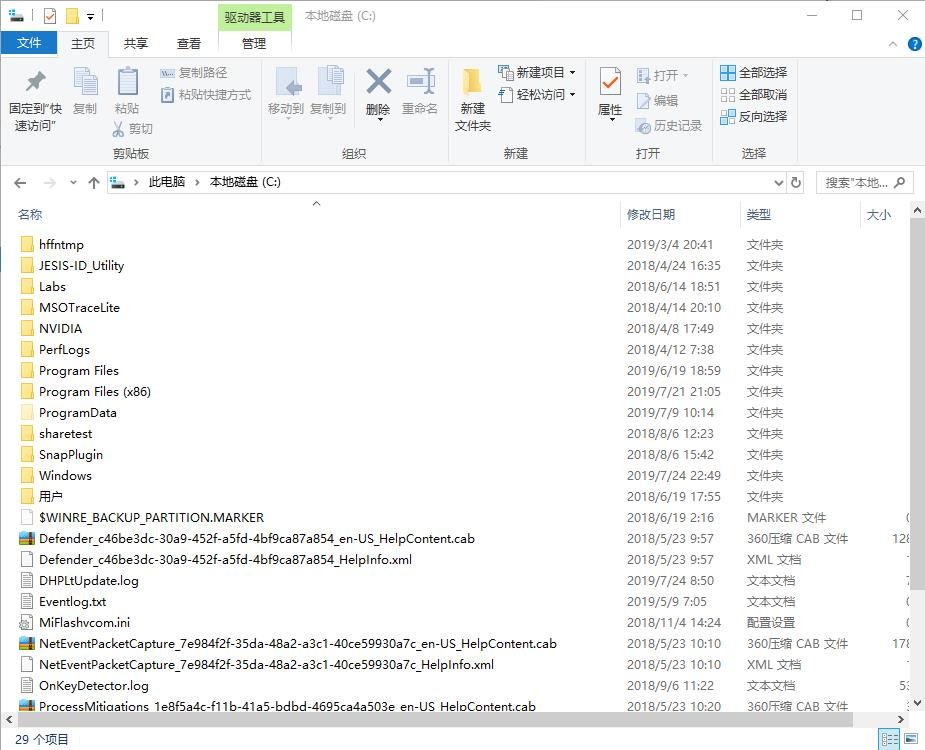
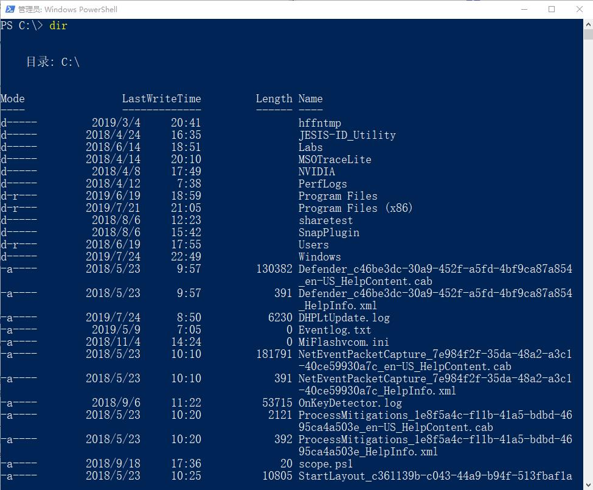

# 认识PowerShell

## Windows Powershell是什么？

**命令行管理工具**

平时我们使用操作系统，如Windows10，我们是通过一个图形化的界面，通过鼠标点击等操作完成的，比如查看文件夹下的内容，我们打开文件夹就看到了。

PowerShell是基于命令行的管理工具，用户通过键盘输入指令，计算机接收到指令后，予以执行。比如同样是查看文件夹下的内容。

**脚本语言**

脚本语言通常是解释型语言，不同于编译型语言，编译型语言是源代码通过编译，变成可执行程序，之后就不需要再编译了，就可以重复执行执行程序，而解释型语言，每次都需要通过解释器来解释，再执行。

所以，脚本语言，需要特定的解释器，每次执行操作前，会由解释器，将你写的代码解释成机器语言再执行。

脚本语言，通常用于自动化的工作控制，用户使用脚本语言，把一些常用的操作组合成一组操作，来自动化的执行一系列操作。

## 基于.NET Framework

PowerShell基于.NET Framework CLR和.NET Framework，能够接收和返回.NET Framework对象，不是基于文本的脚本语言，是基于对象的脚本语言。  

**.NET Framework CLR和.NET Framework**

.NET是由为微软开发的公共语言运行时，可由多种编程语言使用。

CLR的核心功能包括：内存管理、程序集加载、安全性、异常处理和线程同步等。

高级编程语言通过运行时环境和框架，对于通用的一些功能实现，可以直接调用相应的类，实现相应的功能来使编程变得更便利、高效和稳定等等。

PowerShell是基于.NET的。

**基于对象**

在后面的内容，理解PowerShell的重要概念时，我们会讲解什么是基于对象。

## CLI之于GUI的意义

PowerShell是命令行（Command-line Interface）的工具，与图形化（Graphical User Interface）的工具相比，有两个明显的特征。  

**提升效率**

GUI更友好，但是没有办法批量的去执行，也是不容易复制的，所以需要维护一个比较大的环境，有一定的重复性，包括能够让别人很好的执行，就都可以使用CLI的方式。  

**资源占用**

相比与GUI，CLI对系统资源的占用是小得多的，可以快速的加载，如果是对于一个特别大的环境，比如公有云，成百上千，甚至成千上万的服务器，使用非GUI的系统，节省下来的资源就非常可观了。  

## 拥抱开源

PowerShell在开源社区Github上开源，基于Windows PowerShell的一个分支PowerShell Core，不仅可以支持Windows平台，还开始支持在Linux和MacOS上使用。

这意味着有更多的平台的使用者可以通过PowerShell来管理他们的环境。

[https://github.com/powershell/powershell](https://github.com/powershell/powershell)
