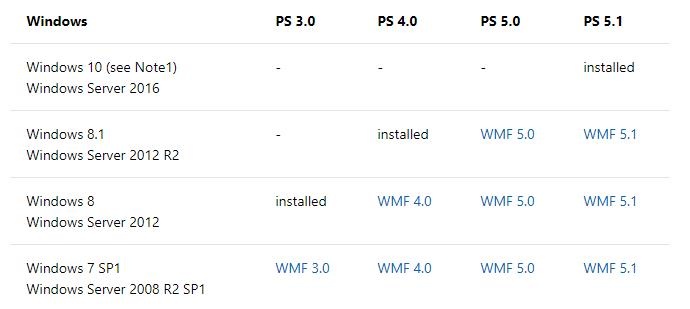

# 安装Windows PowerShell

很多我们正在使用的Windows系统是已经安装了Windows PowerShell的，我们的教程所使用的PowerShell版本是5.1.

不同版本的PowerShell可能会存在差异，下面是不同版本的Windows操作系统所预装的PowerShell版本。

可以在后面的课程[开始使用Windows PowerShell](Part.2.D.3.start.with.powershell.consol.ipynb)中看到如何打开PowerShell控制台及如何查看PowerShell的版本。

如果需要将您现在系统中的Windows PowerShell升级至5.1版本，请点击下面的链接下载WMF 5.1。

[https://www.microsoft.com/en-us/download/details.aspx?id=54616](https://www.microsoft.com/en-us/download/details.aspx?id=54616)

下面的链接，提供了在各种主流的不通系统上安装powershell的步骤

[https://docs.microsoft.com/en-us/powershell/scripting/install/installing-powershell-core-on-windows?view=powershell-6"](https://docs.microsoft.com/en-us/powershell/scripting/install/installing-powershell-core-on-windows?view=powershell-6")
