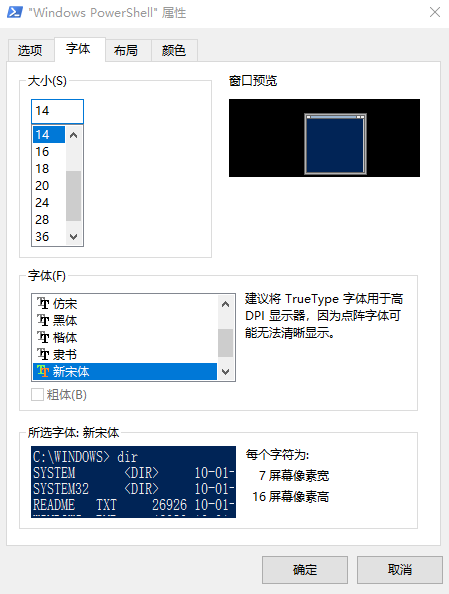

# 开始使用Windows PowerShell

## 打开Windows PowerShell控制台

点击“开始”，或按键盘上的“Win”键，然后输入Windows PowerShell，就可以找到Windows PowerShell了。

点击或者右键以“管理员身份运行”就可以直接打开或者以管理员权限打开Windows PowerShell控制台了。

除了控制台，我们还能看到Windows PowerShell ISE，ISE主要是写脚本的时候会用到，我们平时主要是使用控制台。

> Windows Server操作系统中默认是不装ISE的，如果你需要用，你需要在Windows Features中手动添加ISE功能进行安装，或者在PowerShell控制台中执行`Add-WindowsFeature powershell-ise`来进行安装。

## 查看当前Powershell版本

在PowerShell的命令行中输入`$PSVersionTable`就可以查看当前PowerShell的版本，不同的版本执行相同的命令可能会得到不同的结果。

## PowerShell控制台窗口的调整

在开始正式使用PowerShell之前，我们要熟悉PowerShell控制台的设置，如字体、字号。

我们要将字体调整到能够分清楚各种标点符号及合适的字号。比如能够很好的区分重音符“\`”和单引号“\'”。

**【练习】**  
请自己熟悉一下PowerShell控制台窗口的设置
