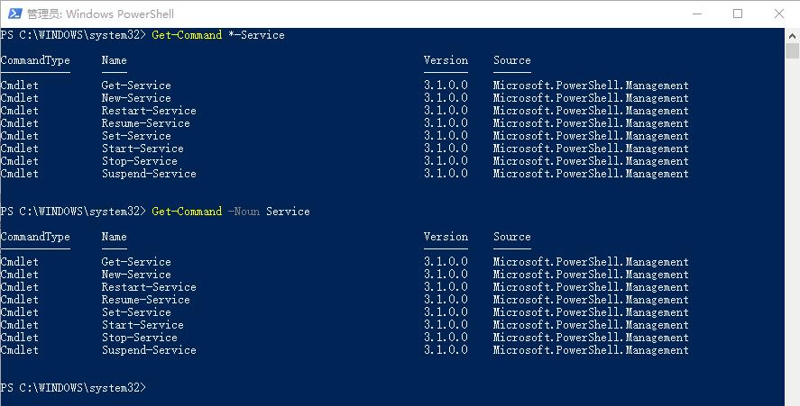

# 获取关于命令的信息

## 通过类型获得命令

你可以使用Get-Command来获取你想要的命令。

PowerShell定义了三种类型的命令：
> * Aliases
> * Functions
> * Scripts

**【例如】**  
通过命令
```bash
Get-Command -CommandType Scripts
```
可以获取到可用的类型为“Scripts”的命令。

## 通过关键字获得命令

你可以通过关键字来偶去你想要的命令，支持通配符。

**【例子】**  
获取所有名词为Service的命令：
```bash
Get-Command *-Service
```
因为使用了通配符，这跟我们前面使用的下面的命令效果是一样的。
```bash
Get-Command -Noun Service
```


# 命令的结构

我们已经用过一些命令了，现在我们来看一条命令的结构。

**【例子】**

```bash
Get-Command -CommandType Scripts
```

> * Get-Command 是命令
> * -Command 是参数
> * Scripts 是参数值

PowerShell命令的使用，都是基于这个结构来使用了，同一条命令里面，可以同时使用多个参数。

