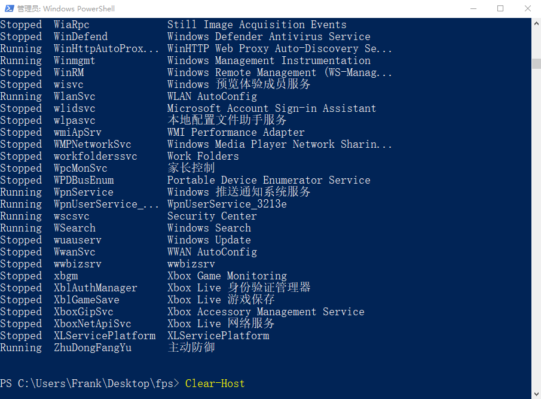
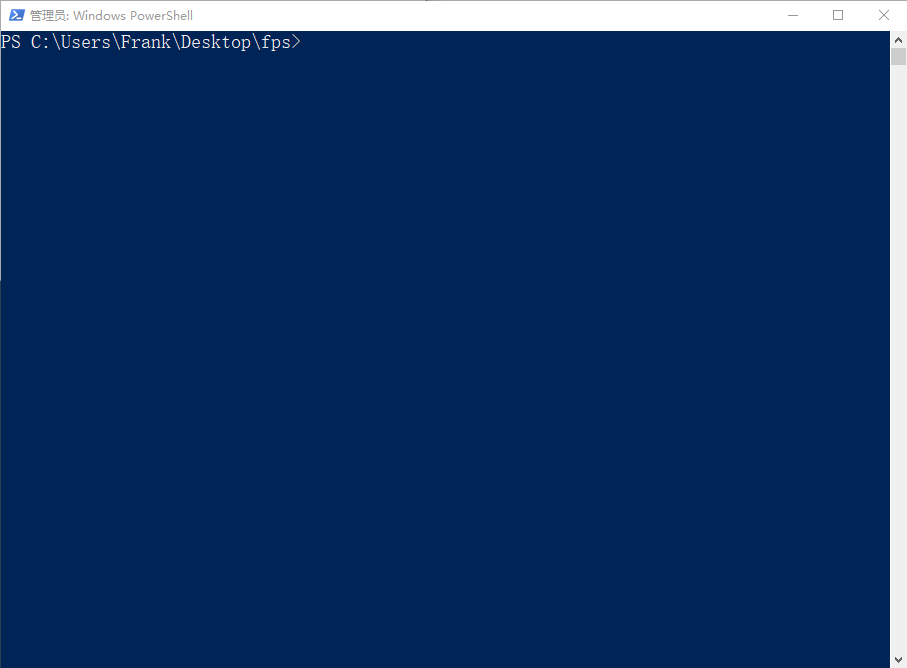
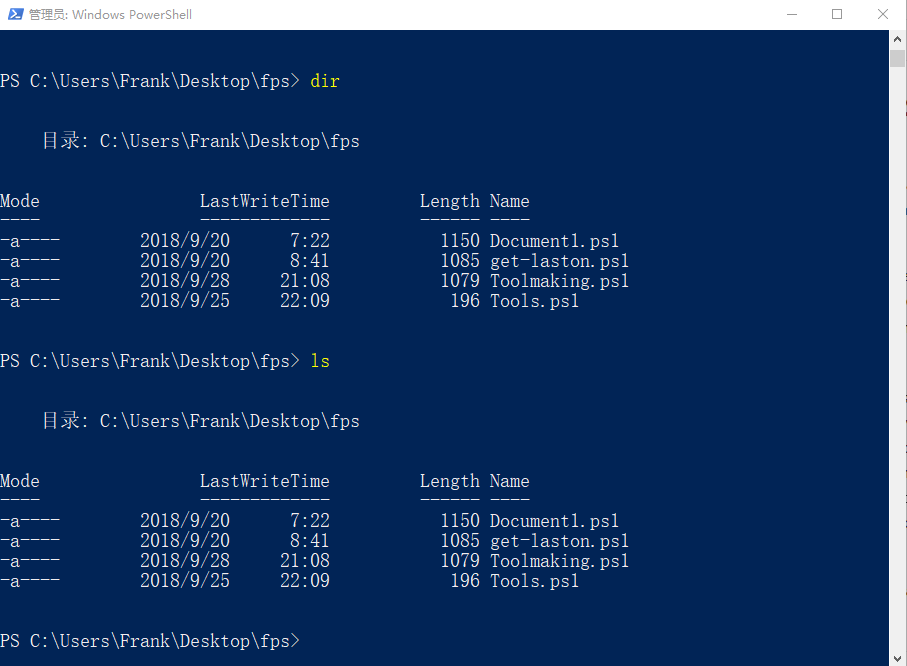
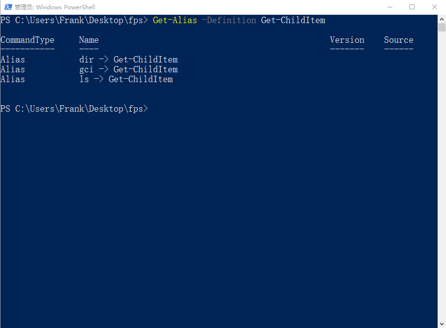
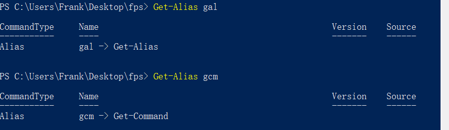
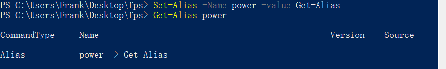
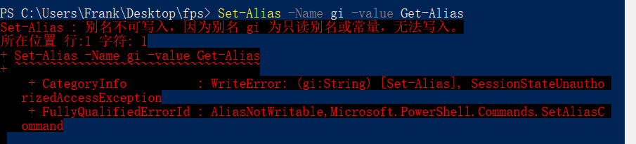
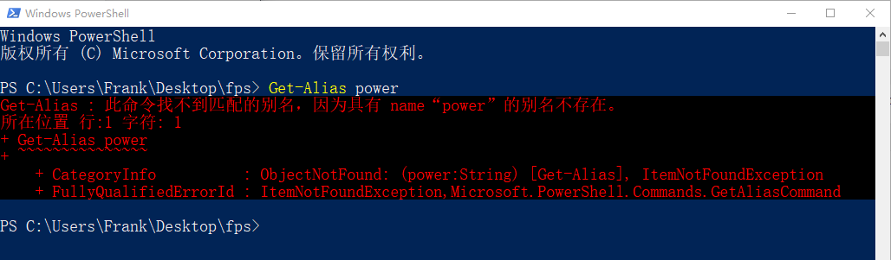

# 使用PowerShell命令的别名

## 查看别名

PowerShell是支持别名的，也就是说，你可以用别的名字来代替某一个命令来使用。

**【例子】**  

像现在想清空屏幕上的显示：  

  

回车后，屏幕内容被清空了  



如果您用过CMD，您可能会知道，可以通过`cls`这个命令来清空屏幕的显示，我们试着在PowerShell窗口中输入`cls`，你会发现，同样可以清空屏幕上的显示。

那这个过程中发生了什么呢？

我们通过命令：

```bash
Get-Alias cls
```

可以发现，原来`cls`是“指向”`Clear-Host`这个命令的，也就是说其实当你输入`cls`的时候，执行的还是`Clear-Host`这个命令。

这样的设计有什么意义呢？这就意味着如果你在其他的CLI环境中熟悉的命令，很可能可以直接在PowerShell中保持原来的使用习惯来使用。

**【例子】**

  

你会发现，对于列出当前目录的对象，无论是CMD中的`dir`还是Linux中的`ls`，都可以在PowerShell中直接使用。

而实际上，他们都是命令`Get-ChildItem`的Alias



如例子中展示的，可以通过命令`Get-Alias`查看某个alias指向的是哪个cmdlet，也可以通过加参数`-Definition`来查看某个cmdlet有哪些alias。

**【练习】**  
如果你原来用过获取内容的命令，试试您熟悉的获取内容的命令在PowerShell中是哪个命令？
看看`Get-Content`这个命令有哪些别名？

## 标准别名

除了一些能够方便保留使用习惯而存在的别名，PowerShell还内置了一些标准的别名，以替代常用的动名词，以便减少输入，提高便利性。

**【例子】**  

|Word|Alias|
|----------|----|
| Get      | g  |
| Set      | s  |
| Item     | i  |
| Location | l  |
| Command  | cm |
| Alias    | al |

对于一些我们之前遇到过的命令：

Get-Alias = gal  

Get-Command = gcm



**【练习】**  
`Set-Location`是进到某个目录的名字，跟CMD中`cd`的作用是一样的，你猜猜`Set-Location`的标准别名是什么呢？

## 创建新的别名

PowerShell也是支持设置别名的，你可以对某一个cmdlet设置一个自己想用的别名。

**【例子】**  

比如我就想把power作为`Get-Alias`的别名



但是对于PowerShell标准的别名是有保护的。  

比如我想用Get的g和Item的i这两个标准别名来作为`Get-Alias`的别名



系统会提示我，gi是个只读别名或常量，无法写入。

最后一点，Set-Alias只是对当前窗口会话生效，也就是说，你关闭当前窗口，设置就又恢复了。

我重新打开了窗口，发现刚才设定的power这个别名已经失效了。



**【练习】**  
给Get-Alias设置一个你喜欢的别名，关闭窗口打开再试试，看看还能不能用？

## 参数别名

参数也有自己的别名，可以减少输入，提高命令的使用效率。

```bash
(get-command Get-EventLog | select -ExpandProperty parameters).computername.aliases
```
