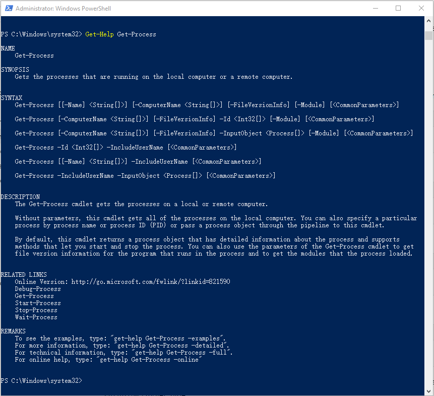
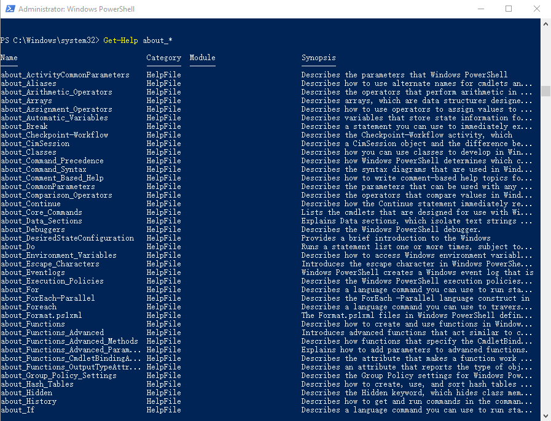
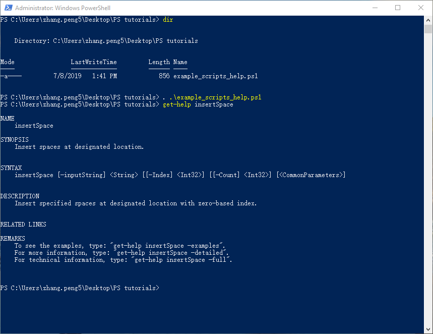
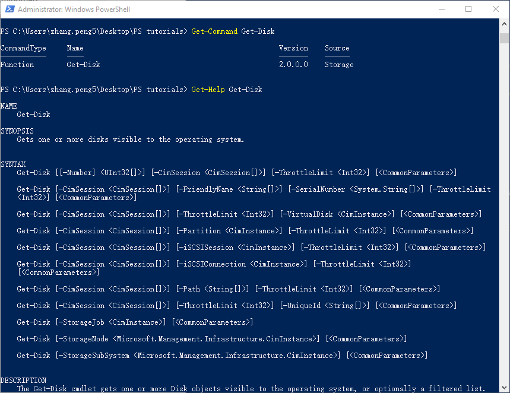

# 帮助系统

PowerShell有完善的帮助系统，学习使用帮助，是非常重要、有效的学习PowerShell的途径。

## 更新帮助系统

为了能查到相关的帮助信息，确保你的机器能够访问因特网，执行下面的命令，可以将最新的PowerShell帮助信息更新到你的本地计算机。

因为帮助文件在System32文件夹下，所以你执行下面的命令需要以管理员权限打开PowerShell控制台。

```bash
Update-Help
```

> 如果你需要为离线计算机更新帮助，请点击[为离线计算机更新帮助](T-appendix.tips.ipynb#为离线计算机更新帮助)

## 获得cmdlets的帮助信息

通过Get-Help命令，可以获得cmdlets的帮助信息

**【例子】**  
```bash
Get-Help Get-Process
```


你甚至可以看看Get-Help的帮助信息
```bash
Get-Help Get-Help
```
如果不使用任何参数，你看到的是一个概略的信息，如果你想查看完整的帮助信息，可以使用参数`-Full`
```bash
Get-Help Get-Help -Full
```
如果想查看关于参数的帮助信息，可以使用参数`-Parameter`
```bash
Get-Help Get-Help -Parameter *
```
如果想查看示例，可以使用参数`-Examples`
```bash
Get-Help Get-Help -Examples
```

**【练习】**  
1.查看Get-ChildItem的帮助信息

## 获得PowerShell内置概念的帮助信息

PowerShell有一类特殊的信息，不是cmdlets命令，是一些以“about_”开头的内容，这些是PowerShell的概念信息，通过Get-Help也可以查看这些概念信息。

**【例子】**  
比如：
```bash
Get-Help about_command_syntax
```
查看PowerShell中的关于命令的语法的描述信息。

还可以通过通配符，查看所有的PowerShell中的概念。
```bash
Get-Help about_*
```



**【练习】**  
查看一下PowerShell概念：about_CommonParameters的帮助文件的内容。

## 获取scripts和functions的帮助信息

如果scripts和functions中编写了帮助信息，也是可以通过Get-Help来查看的。

**【例子】**  
获取scripts的帮助信息：
下面是我自己写的一个脚本，可以通过Get-Help来查看脚本里面的帮助信息。

  

获取funcitons的帮助信息：  
Get-Disk是PowerShell中的一个Function，不是标准的cmdlet，我们也可以通过Get-Help来查看Function的帮助信息。



**【练习】**  
1.查看脚本的帮助：
  1）把下面的内容复制到记事本中，并保存为scripthelp.ps1文件
  ```bash
  function insertSpace {
    <#
    .SYNOPSIS
    Insert spaces at designated location.
    .DESCRIPTION
    Insert specified spaces at designated location with zero-based index.
    .PARAMETER inputString
    Input the string which you want to insert space.
    .PARAMETER Index
    Specified where zero-based you want to insert the space.
    .PARAMETER Count
    Specified how many spaces you want to insert.
    .EXAMPLE
    insertSpace -inputString "HelloSPO" -Index 5 -Count 1
    Hello SPO
    #>  
        [CmdletBinding()]
        param (
            [Parameter(Mandatory=$True)]
            [string]$inputString,
    
            [Int]$Index,
          
            [Int]$Count
        )
        for($i=1;$i -le $Count;$i++){
            $spaces += " "
        }
        return $inputString.insert($index,$spaces)
    }
  ```
  2）在PowerShell窗口中，通过cd命令，进入到该ps1文件所在的路径
  3）通过命令加载该脚本
  ```bash
  . .\scripthelp.ps1
  ```
  4）查看该脚本中function：insertSpace的帮助信息。
  ```bash
  Get-Help insertSpace
  ```

## 获得在线帮助

如果您的机器可以访问因特网，在使用Get-Help的时候，通过`-Online`参数，可以打开浏览器以显示最新的在线帮助信息。

**【例子】**  
```bash
Get-Help Get-Help -Online
```

