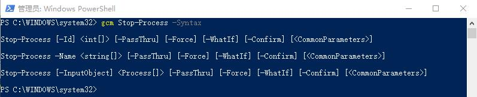
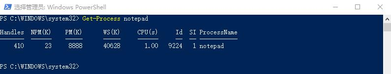
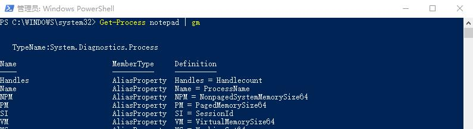
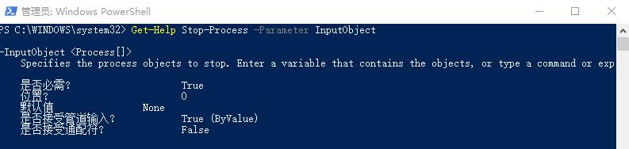

# 管道

我们现实生活中，一条长长的一组管道往往是由很多结各自不同功能的小管道组成的。

比如：有的是直通，有的是拐弯，有的是分流，有的是汇聚，等等。

在Shell中，我可能需要好多步骤完成一个任务，我可以把每一小步用一个命令实现，然后通过管道，把每一小步骤联结到一起，完成一个多步的复杂的任务。

## PowerShell管道

PowerShell的管道，是通过管道操作符“|”，将命令们联结起来。

前一个命令的输出对象是下一个命令参数的接收对象。

## 管道中的对象

我们来通过关闭指定的一个记事本的例子，来初步感受一下管道中的对象。

### 【例子】

我们现在的需求是通过PwoerShell关闭打开的记事本程序。

我们首先想到的会是Stop-Process这样的命令，我们看看这个命令的语法：



我们看到我们可以通过参数`-ID`来结束这个进程，可是问题是我们不知道记事本的进程ID。

接下来我们通过Get-Process来查看一下记事本的进程。



这时候我们就可以通过下面的命令来结束记事本程序的进程了：

```bash
Stop-Process -Id 9224
```

通过Stop-Process的语法我们注意到，Stop-Process这个命令是可以直接接受Porcess这个类型的对象的。而Get-Process得到的对象类型也是Process，根据前面的管道的说明，我们可以设想，是不是可以直接把Get-Porcess这个命令的输出的Porcess作为Stop-Process的命令的对象输入。

```bash
Get-Process notepad | Stop-Process
```

我们发现，确实，记事本程序被直接关闭了。我们再来看一下这个对象的传递。



首先，我们看到Get-Process命令得到的对象的类型是：TypeName：System.Diagnostics.Process



而对于Stop-Process这个命令的`-InputObject`参数所能接收的对象是Process[]，所以，通过管道，我们就把Porcess这个对象，从Get-Process传递到了Stop-Process。

### 【练习】

1.查一下Export-Csv的帮助信息，将Process导出Csv文件到您的桌面。
2.停止一个进程。
