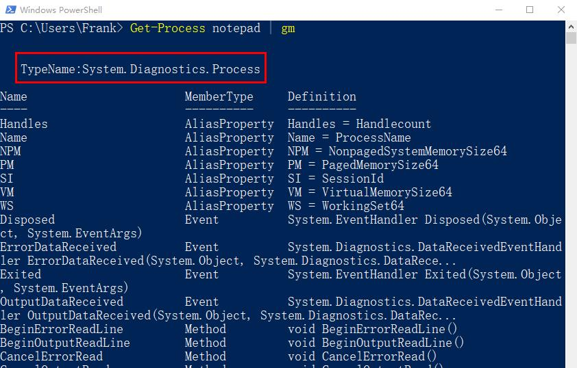

# 对象的类型

对象是有类型的，在管道一篇的内容中我们提到，管道里面传递的是对象，前一个命令的输出结果，会作为后一个命令的参数的输入。

通过命令Get-Member，我们可以看到对象的类型。

### 【例子】

我们可以看到，Get-Procees这个命令得到的结果的对象的类型是：System.Diagnostics.Process

通过Get-Member得到的对象的结果里面，最上面以TypeName开头的部分，就是这个对象的类型。

### 【练习】
看一下以下命令输出的对象的对象类型
