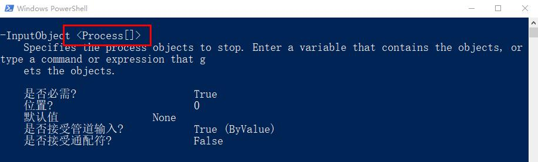

# 参数值类型

参数值也是有类型的。

通过查看参数的帮助信息，我们课可以看到这个参数的参数值类型是什么。

**【例子】**

还是以`Stop-Process`的参数`-InputObject`为例：



这个参数值的类型应该为Process[]

通过下面的命令查看Stop-Process所有参数的参数值类型：

```bash
help Stop-Process -Parameter *
```

我们发现还有：
> * String[]  
> * Int32[]  
> * [SwitchParameter]

String[]叫做字符串类型  
Int32[]是整形的一种
而SwitchParameter是一种特殊的参数，叫开关参数。

无论是String还是Int32，我们是需要提供参数值的，而开关参数是不需要提供参数值的。

**【例子】**


我们可以看到，对于参数`-Name`，我们需要提供一个参数值notepad，而对于参数`-WhatIf`，后面是不需要跟任何值的。

从执行的结果我们看到，`-WhatIf`这个参数的作用是告诉我们，如果我们执行了这条命令会得到什么结果，结果是会对notepad执行Stop-Process的操作。

所以，这种参数就想名字一样，像一个开关一样，你加上这个参数，参数的功能就生效，不加就不生效，而不需要指定什么参数值。

对于数据类型，字符串啊，整形啊，我们会在接下来的内容中讨论。
