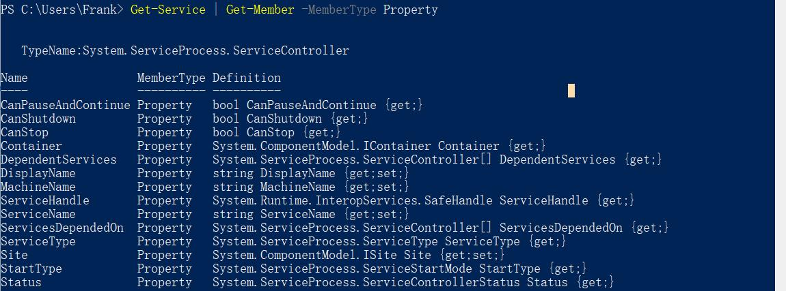

# 对象的操作——Where-Object

一个对象包含很多属性，我们想通过属性来筛选对象的时候，就需要用到Where-Object来操作对象，是一个非常常用的命令。

## 通过对象的属性筛选

我们可以通过对象的属性来筛选对象。

**【例子】**

以Service为例，我们先来查看一下Service有哪些属性。

```bash
Get-Service | Get-Member -MemberType Property
```



现在我们希望能够把所有状态为“Running”的服务筛选出来。

```bash
Get-Service | Where-Object -FilterScript {$_.Status -eq "Running"}
```

**【练习】**

1.把服务中不能停止的筛选出来。  
2.把状态为运行的服务中，不能停止的筛选出来。

## 一个筛选元素里完成多个条件的筛选

可以通过标准的逻辑操作符把多个筛选条件合并成一条。

**【例子】**

```bash
Get-Service | Where-Object -FilterScript {($_.Status -eq "Running") -and ($_.canstop -eq "False")}
```
