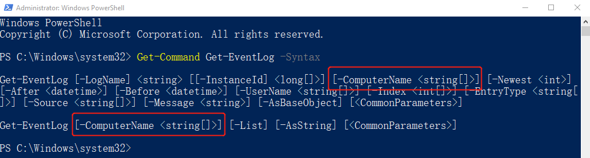

# 参数集

在看帮助信息的时候你可能会有疑惑，有的参数在帮助里面出现了好多次，其实，一个命令是可以有好几个参数集的，而不同的参数集可能会有相同的参数。

**【例子】**

这是`Get-Eventlog`的语法，我们看到，有两行中间隔着一个空白行，这每一行就是一个参数集，所以，`Get-Eventlog`是有两个参数集。

参数`-ComputerName`同时出现在了两个参数集中，在图中用红色的框框了起来。

参数集是如何限制我们参数使用的?如果一个参数只属于一个参数集，那么你用了这个参数，在同一条命令里面，你就只能使用同一个参数集的其他命令。

这是`Get-Eventlog`的语法，我们看到，有两行中间隔着一个空白行，这每一行就是一个参数集，所以，`Get-Eventlog`是有两个参数集。

参数`-ComputerName`同时出现在了两个参数集中，在图中用红色的框框了起来。

参数集是如何限制我们参数使用的?如果一个参数只属于一个参数集，那么你用了这个参数，在同一条命令里面，你就只能使用同一个参数集的其他命令。

> 符号.用来表示本地计算机
