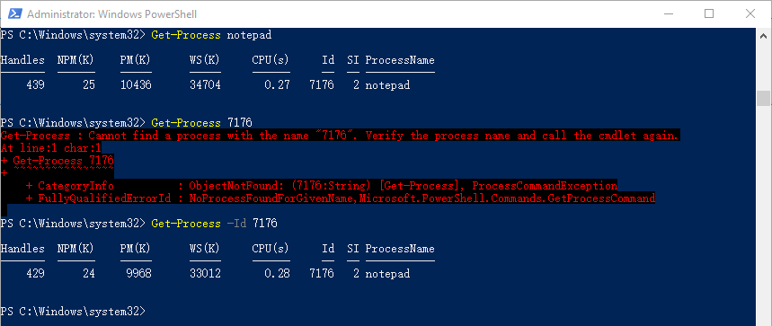
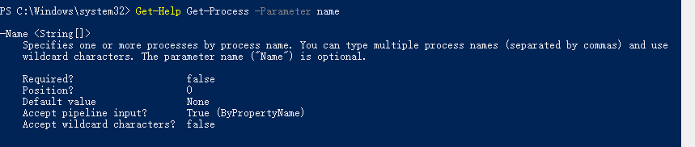
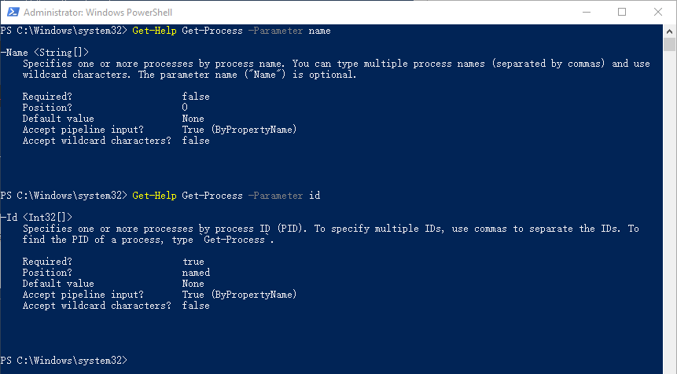
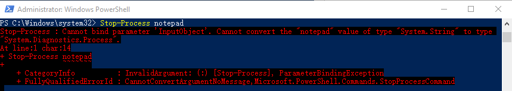
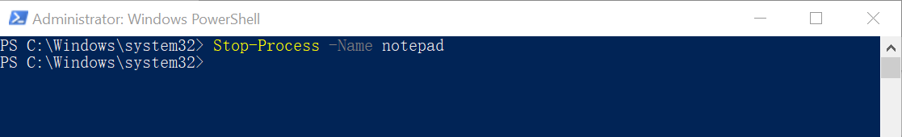
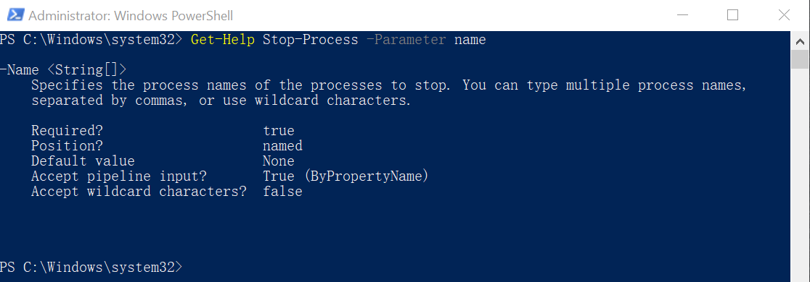

# 参数的帮助信息

在使用cmdlet的过程中，大家可能会有一些疑惑，比如有的命令我后面需要加参数名，而有的只需要加参数值，不需要加参数名。

**【例子】**

我们可以通过记事本进程的名字“notepad”来获取记事本进程的信息，但是我们没有办法直接通过“id”来获取信息，需要加参数“-ID”。

关于参数都有哪些信息呢？

## 是否必须参数？

**【例子】**

上面我们使用Get-Process分别用到了`-Name`和`-ID`这两个参数，我们先来看一下这两个参数的区别。

第一项，是否必须？

我们发现，参数`-ID`是True，也就是说我们在使用命令+这个参数的时候是必须要输入的参数名的。而参数`-Name`是False，意味着使用命令+这个参数时，参数名可以不提供。

因此，对于上面的这个例子，在使用参数Name获取process的时候，是可以不加参数名的，而使用参数ID获取process的时候，是必须要加参数名的。

类似的，我们试试`Stop-Process`。

我们发现`Stop-Process`是不能这么用的

这是我加上参数名Name，发现可以了

让我们来看一下Stop-Process这个命令的Name参数的帮助信息。

果然，对于Stop-Process,`-Name`这个参数的参数名是必须的，所以我们在使用Stop-Process+Name的时候，是必须要提供参数名的。

> 在PowerShell中，可选的是用方括号[]括起来的。
