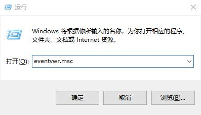
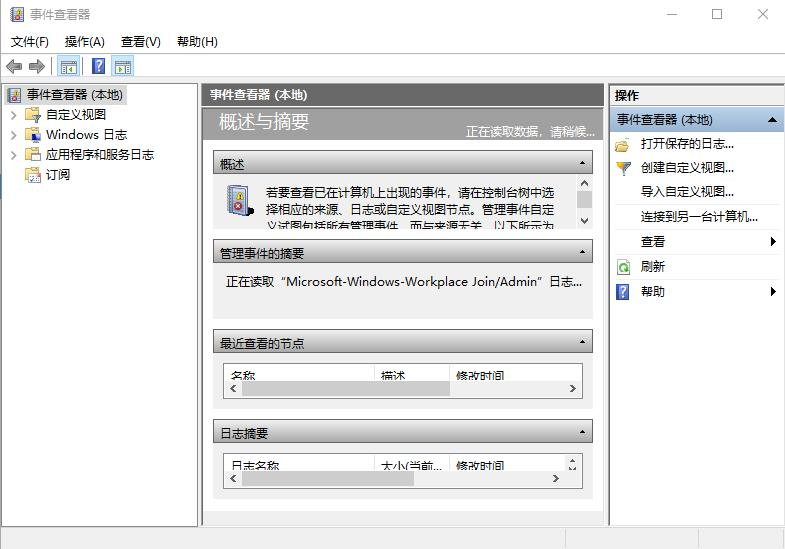
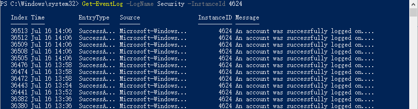
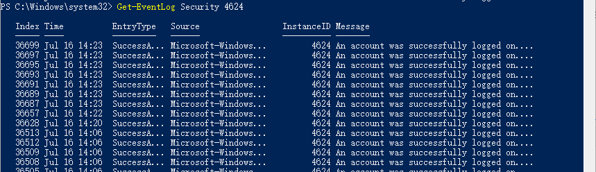
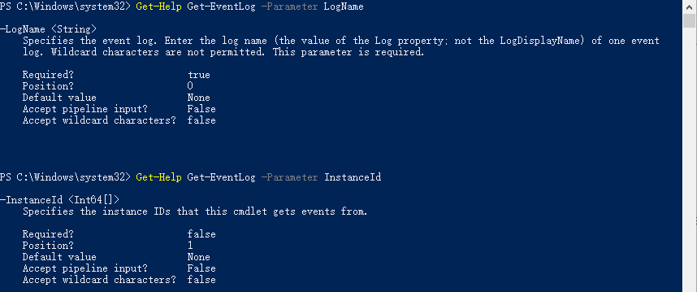
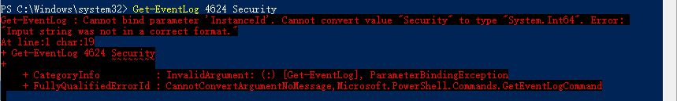
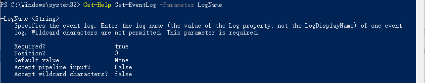
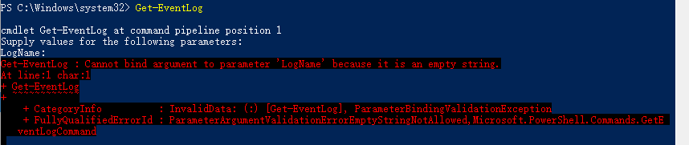
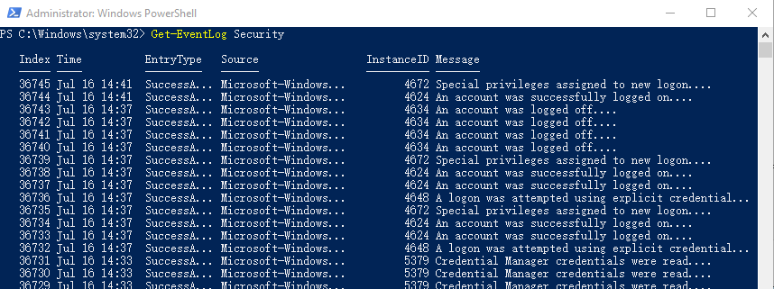

# 1.参数的帮助信息

## 1.2.是否位置参数？

这个位置参数是什么意思？

**【例子】**

事件查看器，是我们经常会用到的一个管理工具。

在运行中输入“eventvwr.msc”可以快速打开它。

在PowerShell中，通过Get-Eventlog，我们也能够获取到我们想要的系统日志，比如我们想查看谁登陆过我这台机器。

我可以使用下面的命令：

这时候，我去掉参数名，我们可以看到，我们可以得到同样的效果。

这时候，我们来看看这两个参数的帮助信息

我们发现在位置参数的描述那，一个是0，一个是1。

也就是说，假如我们不提供参数名，直接提供参数值，参数值会依次按位置编号赋值给参数。

那如果我们把这两个参数值对调，也就是用命令Get-EventLog 4624 Security会得到什么结果呢？

果然，我们收到了报错，并且告诉我们，Security并不能作为一个ID提供给InstanceID这个参数。

好，随着我们积累越来越多，慢慢的，很多操作我们就可以不用参数名了。

对于刚开始学习的你，还是建议尽量使用参数名，以熟悉命令。

大家关于这个位置项有什么疑问吗？

细心地你可能已经发现了，除了0，1之类的，有的参数的位置这项是named，这是什么意思呢？

这是指，这种参数，参数值前面必须要提供参数名，而不是根据0，1这样的顺序自动赋值给参数名。

那这和前面学过的是否必须有什么区别呢？

我们来看一个例子：

**【例子】**

对于Get-Eventlog下面的LogName这个参数，这个帮助信息是什么意思呢？

是否必需？ True，意思就是你要用这个命令，必须要用这个参数。

看，我直接使用Get-EventLog这个命令，但是命令后面不跟任何参数和值，PowerShell会提示我，“请为以下参数提供值：LogName”，当我不提供，直接回车，就会报错。

而我直接使用命令Get-EventLog Security又可以直接得到Security日志

这是因为位置信息为0，也就是Security默认直接赋值给了参数LogName。

所以，概括一下，LogName这个参数的帮助信息告诉我们，这个参数是Get-EventLog这个命令必须要用到的参数，但是是一个位置参数，位置号为0，我不提供参数名直接提供参数值会默认赋值给这个参数。

也就是说，是否必需，确定的是命令是否必须要用这个参数，也就是说这个参数是不是必选参数，而位置决定了这个参数名是否要提供，以及如果不用提供时的参数值赋值顺序。

如果你使用了参数名，就不受位置的限制了。

**【练习】**

方括号[]括起来表示可以省略，结合必须参数和位置参数的知识，思考一下：

`[-LogName]<string>` 和 `[[-InstanceID]<Int64[]>]`参数的帮助信息会是什么样？

反推，如果不看参数的帮助信息，只看语法中的参数信息，能否知道参数该怎么用？
