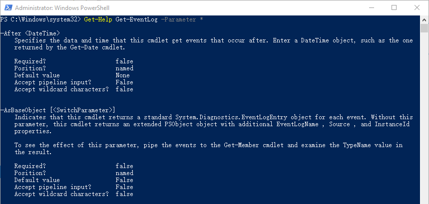

# 1.参数的帮助信息

## 1.3.是否有默认值

以Get-EventLog的参数为例



接着往下看，我们看到了默认值

从名字看，我们不难理解，默认值是什么意思

默认值就是说对于这个参数，如果你不赋予参数值，默认用什么值，通广场情况我们看到的都是None，也就是一般是不赋予默认值的。

那对于默认值为False的是什么情况呢？

字面意思，我们可以理解为这个参数不涉及默认值，那是为什么呢？

我们看截图中的例子，第二个参数`-AsBaseObject [<SwitchParameter>]`，后面有个标识是[<SwitchParameter>]，这种参数叫开关参数，他就像一个开关一下，你加上这个参数就启用，不加就不启用，而不需要跟什么参数值。

再拿我们之前用过的一个命令来举个例子。


`-DependentServices`是Get-Servcie中的一个参数，意思是依赖的服务，也就是说我们加上这个参数，会把服务所依赖的服务一起列出来，所以我们猜想，加上这个参数，Get-Server得到的结果也会更多，那现在我们来试试看。


果然，加上-DependentServices 这个参数，得到了639个结果，而不加这个参数，只有287个结果。

好，通过这部分学习，我们知道了默认值是什么意思，还认识了一种特殊的参数类型，叫开关参数。


```python

```
