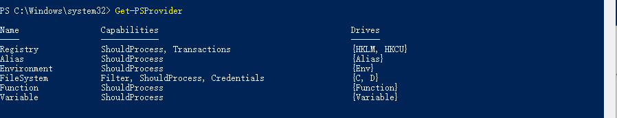

# PowerShell Provider

## 什么是PowerShell Provider

PowerShell Provider或者有时候我们能看到PSProvider，是一种PowerShell的适配器，有点像我们平时用电脑时候接触到的磁盘适配器。

PSProvider看起来像磁盘一样在存储数据。

**【例子】**

可以通过命令`Get-PSProvider`获得已经安装了的PowerShell的Provider。


里面能看到我们熟悉的磁盘盘符，后面我会介绍如何使用provider。

PSProvider也是可以添加的，有些module或者snap-in的添加会新的PSProvider。

> module和snap-in的扩展PowerShell命令的方式，我们会在相关部分讲到，大家可以理解为，为PowerShell扩展命令的时候可能会创建PSProvider。

添加一些PowerShell功能的时候，可能也会创建新的PSProvider。

**【例子】**

开启PowerShell的远程功能，会创建名为WSMan的PSProvider。

## 获取providers的帮助信息

通过Get-Help也可以查看provider的帮助信息。

**【例子】**  
比如：我想看一下注册表provider的帮助信息。  
```bash
Get-Help registry
```
想查看PowerShell中给还有什么provider：
```bash
Get-PSProvider
```


**【练习】**  
1.查看一下provider：FileSystem的帮助信息
