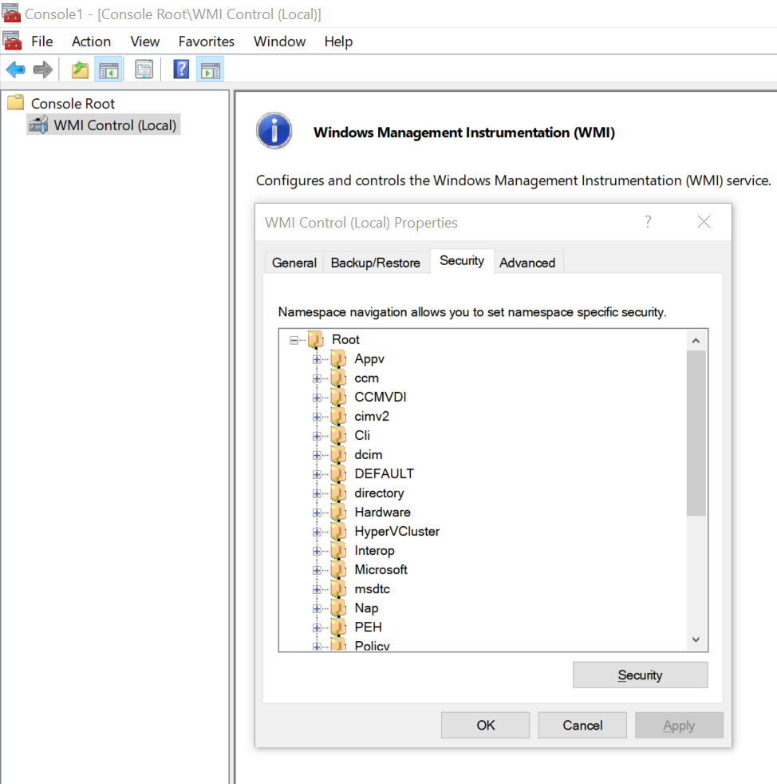

# WMI（Windows Management Instrumentation） Windows管理规范

WMI是微软提供给管理员使用的工具，是一个外部技术，PowerShell仅仅与其接口交互。

通过WMI可以易于访问Windows的信息。

### 例子

我们通过Get-Disk获取到磁盘的信息，但是获取不到分区的信息，或者逻辑磁盘的信息，我们可以通过WMI获取到磁盘的信息。

```powershell
PS C:\Users\zhang.peng5> Get-WmiObject win32_logicaldisk


DeviceID     : C:
DriveType    : 3
ProviderName :
FreeSpace    : 76375494656
Size         : 161061269504
VolumeName   :

DeviceID     : D:
DriveType    : 3
ProviderName :
FreeSpace    : 258940956672
Size         : 350402637824
VolumeName   :
```

root\CIM包含了Windows操作系统和计算机硬件信息。  
root\MicrosoftDNS包含了所有关于DNS服务器的信息。  
root\SecurityCenter包含了关于防火墙、杀毒软件和反流氓软件等工具的信息。

通过MMC上的WMI控制单元查看命名空间：




```powershell
(Get-WmiObject -Class Win32_OperatingSystem -ComputerName .).Win32Shutdown(0)
```
