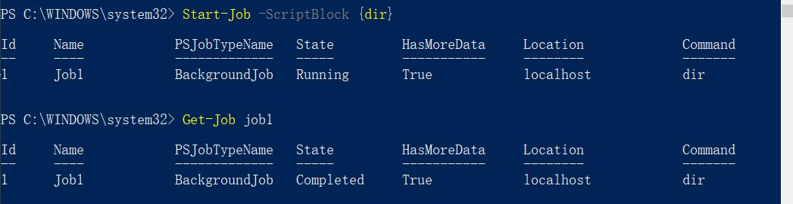

# 创建任务

我们现在通过PowerShell工作的时候，是键入一条命令，然后按回车，等待命令执行结束。除非第一条命令执行结束，否则你无法运行第二条命令。

PowerShell是可以多个任务同时处理的。

通过PowerShell后台作业，可以讲一个命令移至后台独立的进程来执行。这样，当前的PowerShell窗口就可以继续工作。

# 本地作业

一个命令几乎完全在你的本地计算机后台运行。

```powershell
Start-Job -ScriptBlock
```

### 【例子】



执行完后，PowerShell就会创建一个后台作业在本地，默认情况下，以Job加编号命名，可以通过参数`-Name`来自定义作业的名称。

如果执行的命令中包含有`-ComputerName`参数，则作业中的命令会访问远程计算机。作业的进程会在本地计算机上运行，他会与指定的远程计算机进行连接。

### 【例子】

```powershell
PS C:\WINDOWS\system32> Start-Job -ScriptBlock {Get-EventLog Security -ComputerName localhost }

Id     Name            PSJobTypeName   State         HasMoreData     Location             Command
--     ----            -------------   -----         -----------     --------             -------
3      Job3            BackgroundJob   Running       True            localhost            Get-Event...
```

### 注意

尽管本地作业是在本地运行，但是他们也会需要使用PwoerShell远程处理系统的架构，如果没启用远程处理，那么将无法创建本地作业。

# WMI Job

Get-WMIObject命令会与一台或多台远程计算机进行连接，但是通过串行方式实现。

这意味着，如果目标是很多计算机，将需要话费很长的时间执行某个命令，可以通过将命令移至后台作业来并发执行。

在`Get-WMIObject`命令后面使用`-AsJob`参数，可以创建WMI Job。

```powershell
Get-WMIObject Win32_OperatingSystem -ComputerName (Get-Content allservers.txt) -AsJob
```

这种情况，PowerShell会为这个Job创建一个上层的父Job，对每一个目标计算机创建一个子Job来执行任务，Job的名字不能自定义。

如果遇到不可访问的计算机，默认规则是跳过。

# 远程处理作业

通过Invoke-Command来创建Job。

```powershell
Invoke-Command -Command {Get-Process} -ComputerName (Get-Content .\servers.txt) -AsJob -JobName RemoteJob
```

命令会并行发送到指定的每台计算机，可以同时访问32台（除非你更改ThrottleLimit参数），超过32的部分会放入队列等待前面的32台结束，当所有的计算机上都执行结束后，父Job会返回一个完整的状态。

因为命令会真正在每台远程计算机上执行，所以可以通过分布式计算工作负载提升复杂的或者长时间运行命令的性能。 执行结果会返回到你的本地计算机。

并且，可以使用`-JobName`参数指定一个特有的作业名称。

