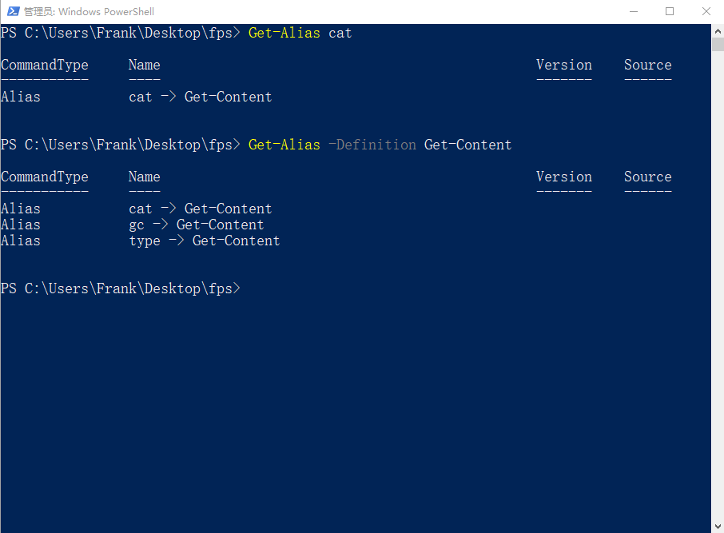
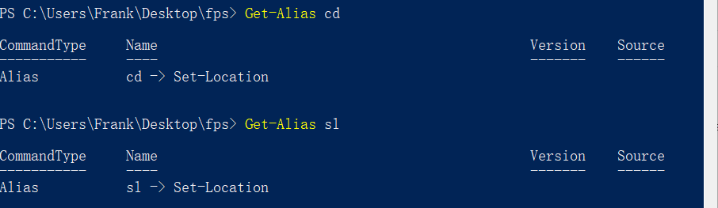
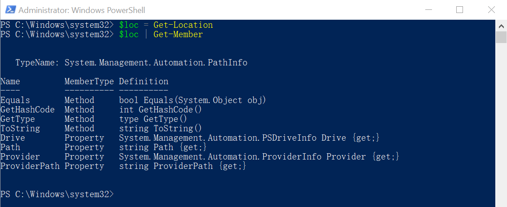

# 4.1
# 1.1
1.
```powershell
Get-Process notepad | Select-Object id
```

# 5.1
# 1.1
1.
```bash
Get-Command -Verb stop
```
2.
```bash
Get-Command -Noun process
```

# 6.1
## 1.1

## 1.2
sl  


# 7.1
## 1.2
1.  
```bash
Get-Help Get-ChildItem
```

# 9.1
## 1.3
1.结果跟下列命令的结果一样：
```bash
Get-Location | Get-Member
```




```python

```
