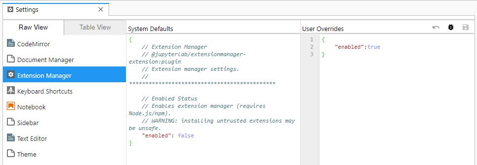

# Jupyterlab的安装与配置

Anaconda是目前最方便的Python发行版，搭载了很多我们需要用到的软件包。

我们将在Anaconda上使用Jupyterlab。

## 下载并安装Anaconda

Anaconda有图形化的安装教程，官方的很详细：  
> [https://docs.anaconda.com/anaconda/install/](https://docs.anaconda.com/anaconda/install/)

安装完毕之后，打开Anaconda Prompt，继续安装几个组件：

```powershell
conda update conda
conda update anaconda
conda install -c conda-forge nodejs
conda install -c conda-forge jupyterlab
```

## 初始建议配置

打开 Anaconda Prompt，输入以下命令：
`jupyter lab --generate-config`

会在```C:\Users\<username>\.jupyter\```目录下生成一个```jupyter_notebook_config.py```文件。

使用编辑器打开这个`jupyter_notebook_config.py`文件。
如果在装Anaconda的时候选择安装了Visual Studio Code，并且设置了`Install 'code' command in PATH`，则可以直接在Anaconda Prompt中执行
```powershell
cd C:\Users\Frank\.jupyter
code jupyter_notebook_config.py
```
来通过Visual Studio Code打开该.py文件。

在文件的末尾直接粘贴：
```json
c.NotebookApp.token = ''
```

解释一下：
> `c.NotebookApp.token = ''`

基于安全策略，每次打开 Jupter，它都会给你生成一个新的 Token。但是，如果你只是在自己的电脑上使用，那么，这就给你制造了麻烦，因为若是你想同时用另外一个浏览器打开它，那你就需要从 Terminal 里拷贝那个 Token 出来。所以，你可以在配置文件里直接把它设置为空。

## 第一次启动Jupyter lab

打开Anaconda Prompt，`cd`到你想浏览、编辑文件的目录，然后输入`jupyter lab`，随后，会用默认浏览器打开一个窗口，地址为：[http://localhost:8888/lab?](http://localhost:8888/lab?)， 这就是Jupyter lab的操作界面了。

**比如：**

我进入到我从Github上fetch到本地的仓库
我在Anaconda Prompt里面输入：
```powershell
cd C:\Users\Frank\Documents\GitHub\PowerShell-Learning-Manual
jupyter lab
```

浏览器就会弹出如下的界面，可以看到，本地仓库里的文件，就可以查看和编辑了。


## 安装插件

Jupyter有很多扩展插件，推荐一个对我们写教程比较有帮助的插件。

> @jupyterlab/toc

首先打开在JupyterLab菜单栏中的Settings——Advanced Setting Editor，在Extension Manager中添加User Overrides:
```json
{
    "enabled": true
}
```
如下图：



然后在Anaconda Prompt中执行以下命令安装插件：  
```powershell
jupyter labextension install @jupyterlab/toc
jupyter lab build
```

toc插件，可以自动将ipynb文件中的标题，按标题级别，转化成分级目录。
